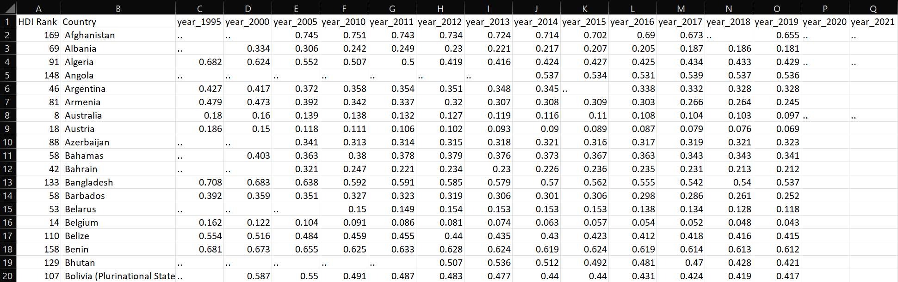
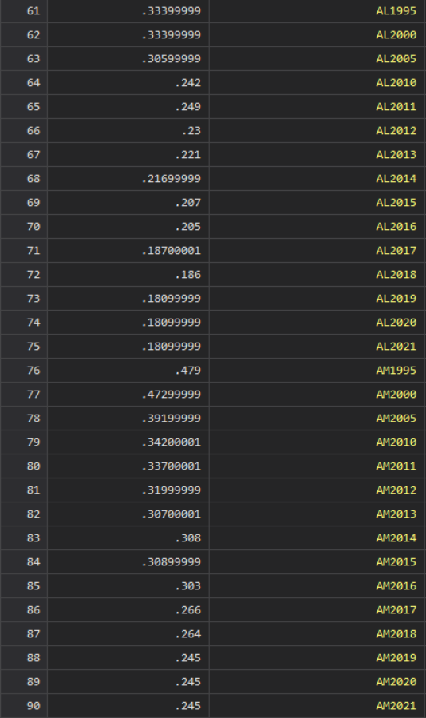

# Stata Panel Data Transformation and Interpolation
Written for Renée Adams' research project at Said Business School, University of Oxford.

## Description
The purpose of the code is to merge country-year level gender inequality data for art fairs, and country level aggregate data for artist nationality to art price database.

## Transformation goal

## data_transform_merge.do
Complete do file used for the merge.
## transform_algorithm.do
Purely the algorythm used in database transformation and interpolation.
